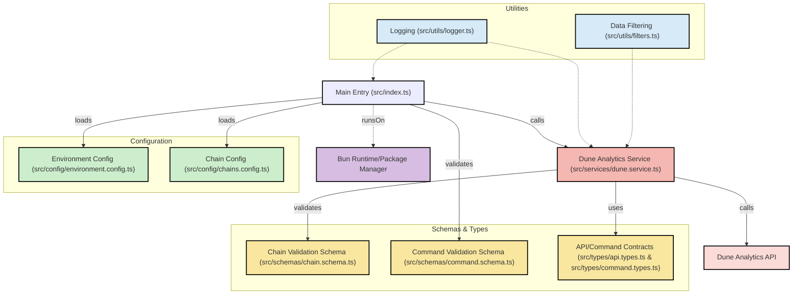

# code-structure

```mermaid
flowchart TD
    subgraph "Configuration"
        EnvironmentConfig["Environment Config (src/config/environment.config.ts)"]
        ChainConfig["Chain Config (src/config/chains.config.ts)"]
    end

    subgraph "Schemas & Types"
        ChainSchema["Chain Validation Schema (src/schemas/chain.schema.ts)"]
        CommandSchema["Command Validation Schema (src/schemas/command.schema.ts)"]
        Types["API/Command Contracts (src/types/api.types.ts & src/types/command.types.ts)"]
    end

    subgraph "Utilities"
        Logger["Logging (src/utils/logger.ts)"]
        Filters["Data Filtering (src/utils/filters.ts)"]
    end

    MainEntry["Main Entry (src/index.ts)"]
    DuneService["Dune Analytics Service (src/services/dune.service.ts)"]
    ExternalAPI["Dune Analytics API"]
    BunRuntime["Bun Runtime/Package Manager"]

    MainEntry -->|"loads"| EnvironmentConfig
    MainEntry -->|"loads"| ChainConfig
    MainEntry -->|"validates"| CommandSchema
    MainEntry -->|"calls"| DuneService
    DuneService -->|"calls"| ExternalAPI
    DuneService -->|"validates"| ChainSchema
    DuneService -->|"uses"| Types
    MainEntry -.->|"runsOn"| BunRuntime
    Logger -.-> MainEntry
    Logger -.-> DuneService
    Filters -.-> DuneService

    click MainEntry "https://github.com/cipher-rc5/echo-client/blob/main/src/index.ts"
    click EnvironmentConfig "https://github.com/cipher-rc5/echo-client/blob/main/src/config/environment.config.ts"
    click ChainConfig "https://github.com/cipher-rc5/echo-client/blob/main/src/config/chains.config.ts"
    click ChainSchema "https://github.com/cipher-rc5/echo-client/blob/main/src/schemas/chain.schema.ts"
    click CommandSchema "https://github.com/cipher-rc5/echo-client/blob/main/src/schemas/command.schema.ts"
    click Types "https://github.com/cipher-rc5/echo-client/blob/main/src/types/api.types.ts & src/types/command.types.ts"
    click DuneService "https://github.com/cipher-rc5/echo-client/blob/main/src/services/dune.service.ts"
    click Logger "https://github.com/cipher-rc5/echo-client/blob/main/src/utils/logger.ts"
    click Filters "https://github.com/cipher-rc5/echo-client/blob/main/src/utils/filters.ts"

    classDef entry fill:#aqua,stroke:#000,stroke-width:2px;
    classDef config fill:#cceecc,stroke:#000,stroke-width:2px;
    classDef schemas fill:#f9e79f,stroke:#000,stroke-width:2px;
    classDef service fill:#f5b7b1,stroke:#000,stroke-width:2px;
    classDef utility fill:#d6eaf8,stroke:#000,stroke-width:2px;
    classDef external fill:#fadbd8,stroke:#000,stroke-width:2px;
    classDef runtime fill:#d7bde2,stroke:#000,stroke-width:2px;

    class MainEntry entry;
    class EnvironmentConfig,ChainConfig config;
    class ChainSchema,CommandSchema,Types schemas;
    class DuneService service;
    class Logger,Filters utility;
    class ExternalAPI external;
    class BunRuntime runtime;
```
